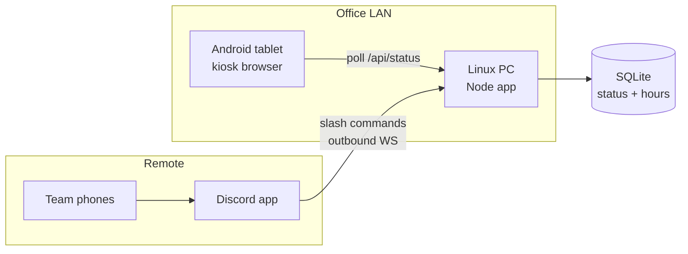

# Rainscope Open Sign — Implementation Plan

## What you are building

A lightweight local web app with three surfaces:

| Surface | Who uses it | Purpose |
|---------|-------------|---------|
| **Kiosk display** | Android tablet (fullscreen browser) | Branded OPEN / CLOSED sign |
| **Discord bot** | Team on phones, anywhere | Remote override + schedule management |
| **Local admin page** | Office PC browser (backup) | Same controls if Discord is unavailable |

The tablet only talks to your office LAN (`http://OFFICE_PC_IP:3847`). No inbound internet exposure is required — the Discord bot connects **outbound** to Discord, which is ideal for self-hosted setups.



## Architecture

**Single Node.js process** on the Linux office PC:

- **Express** serves the kiosk page, admin page, and a small JSON API
- **discord.js** handles slash commands (no port forwarding needed)
- **SQLite** (`better-sqlite3`) stores current status, weekly hours, manual overrides, and audit log
- **node-cron** re-evaluates schedule every minute; manual overrides win until cleared

### Status resolution (priority order)

1. **Manual override** from Discord or local admin (`/open`, `/closed`, `/message "Back at 2pm"`)
2. **Weekly schedule** (e.g. Mon–Fri 9:00–17:00, America/Vancouver)
3. **Default closed** outside configured hours

### API (tablet polls every 5s)

- `GET /api/status` → `{ state: "open" | "closed", message?: string, source: "schedule" | "override", nextChange?: ISO }`
- `GET /display` → fullscreen kiosk page (auto-refresh via fetch, no heavy framework)

## Rainscope branding

- Dark, cinematic background (near-black with subtle grain/gradient)
- Uppercase headline typography, concise copy
- Rainscope logo (from [rainscope.ca](https://rainscope.ca) or provided asset)
- **OPEN**: warm accent (muted green or brand accent) + large "WE'RE OPEN"
- **CLOSED**: restrained red/muted tone + "CLOSED" + optional subline ("Opens Monday at 9:00 AM")
- Footer: `hello@rainscope.ca` or Vancouver address if desired

Keep the frontend vanilla HTML/CSS/JS — important for an old Android tablet (low CPU/RAM, no React bundle).

## Discord commands

| Command | Effect |
|---------|--------|
| `/status` | Show current state, source, and next scheduled change |
| `/open` | Manual override → open |
| `/closed` | Manual override → closed |
| `/message <text>` | Manual override with custom subline (e.g. "Back at 2pm") |
| `/auto` | Clear override; return to schedule |
| `/hours` | View current weekly hours |
| `/set-hours` | Set hours for a day (e.g. `day:monday open:09:00 close:17:00`) |

**Security:** restrict commands to a specific Discord role (e.g. `@staff`) via `DISCORD_ALLOWED_ROLE_ID` in config. Bot token stays in `.env` on the office PC only.

### One-time Discord setup

1. Create a Discord Application at [discord.com/developers](https://discord.com/developers)
2. Add a bot, copy token → `.env`
3. Invite bot to your server with `applications.commands` scope
4. Run `npm run register-commands` once to publish slash commands

## Project structure

```
rssign/
├── package.json
├── .env.example
├── config/
│   └── hours.default.json      # Mon–Fri 9–5 Pacific default
├── src/
│   ├── index.ts                # entry: start server + bot + scheduler
│   ├── server.ts               # Express routes
│   ├── bot.ts                  # Discord slash command handlers
│   ├── scheduler.ts            # resolve open/closed from hours + override
│   ├── db.ts                   # SQLite schema + queries
│   └── register-commands.ts    # one-shot slash command registration
├── public/
│   ├── display/
│   │   ├── index.html
│   │   ├── style.css
│   │   └── app.js              # polls /api/status, updates DOM
│   ├── admin/
│   │   ├── index.html          # password-protected backup UI
│   │   └── app.js
│   └── assets/
│       └── logo.svg            # Rainscope logo
├── deploy/
│   └── rssign.service          # systemd unit for Linux auto-start
└── README.md
```

**Stack:** TypeScript, Express, discord.js v14, better-sqlite3, node-cron. Built with `tsx` for dev, compiled or run directly in production.

## Tablet kiosk setup (Android)

1. Connect to office Wi‑Fi
2. Install **Fully Kiosk Browser** (free tier is fine) or use Chrome in fullscreen
3. Set start URL to `http://<LINUX_PC_LAN_IP>:3847/display`
4. Enable: kiosk mode, keep screen on, auto-relaunch on crash, hide nav bar
5. Optional: set tablet to auto-start Fully Kiosk on boot

Assign a **static LAN IP** (or DHCP reservation) to the Linux PC so the tablet URL never breaks.

## Linux office PC deployment

1. Install Node.js 20+ on the Linux PC
2. Clone this repo, `npm install`, copy `.env.example` → `.env`
3. Install systemd unit from `deploy/rssign.service`:

```ini
[Unit]
Description=Rainscope Open Sign
After=network.target

[Service]
Type=simple
WorkingDirectory=/opt/rssign
ExecStart=/usr/bin/npx tsx src/index.ts
Restart=always
EnvironmentFile=/opt/rssign/.env

[Install]
WantedBy=multi-user.target
```

4. `systemctl enable --now rssign`
5. Verify: `curl http://localhost:3847/api/status`

## Offline / failure behavior

| Scenario | Behavior |
|----------|----------|
| Office PC down | Tablet shows last cached state + "connection lost" banner after ~30s |
| Internet down, LAN up | Display works; Discord commands unavailable until internet returns |
| Manual override active | Stays until `/auto` or admin clears it — schedule does not override |

## Configuration defaults

- **Timezone:** `America/Vancouver`
- **Port:** `3847` (unlikely to conflict)
- **Default hours:** Mon–Fri 9:00–17:00, Sat–Sun closed (editable via Discord `/set-hours` or `config/hours.default.json`)
- **Admin password:** `ADMIN_PASSWORD` in `.env` for local backup page

## Prerequisites before implementation

1. **Rainscope logo file** (SVG or high-res PNG)
2. **Discord bot token** and **server role ID** for staff-only commands
3. **Linux PC LAN IP** (or document how to find it with `ip addr`)
4. **Actual business hours** if different from Mon–Fri 9–5

## Implementation checklist

- [ ] Scaffold project with TypeScript, Express, discord.js, SQLite, and env config
- [ ] Implement scheduler (weekly hours + manual override priority) and `/api/status` endpoint
- [ ] Build Discord slash commands with role gating
- [ ] Build Rainscope-branded fullscreen display page with 5s polling and offline fallback
- [ ] Add password-protected local admin page as Discord backup
- [ ] Add systemd unit and deployment docs

## Out of scope (can add later)

- Multiple locations / signs
- Slack integration
- Cloud backup or Cloudflare Tunnel (self-hosted LAN-only)
- Native Android app (browser kiosk is simpler and sufficient)
